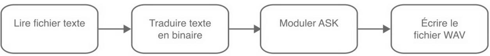
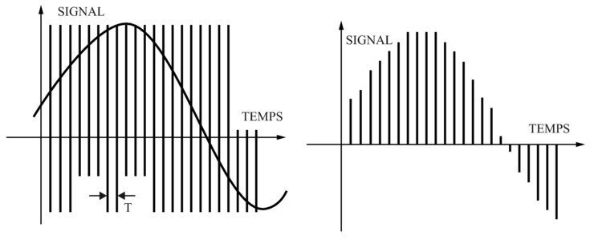
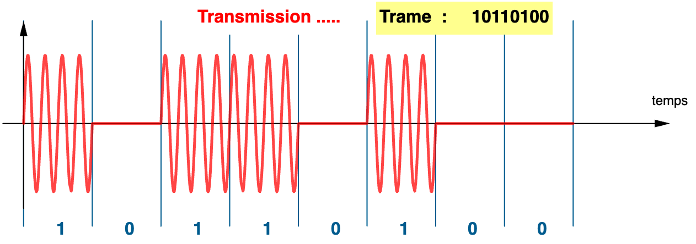
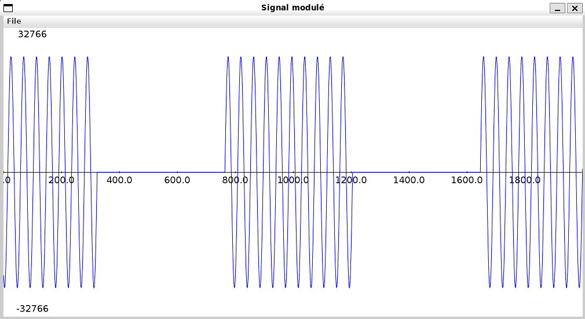
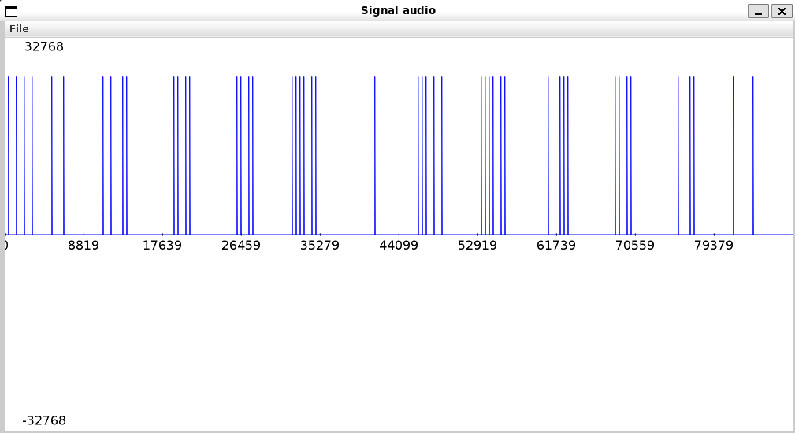

# Equipe Team Chartreuse - Projet BUT Informatique DosOok - 28/11/2023 11/01/2024


## Informations Equipe
- **Membres :**
  - [Cédric COLIN](https://github.com/lynn2910)
  - [Marvyn LEVIN](https://github.com/marvynlevin)

  - **Objectif :** Ce projet vise à concevoir une application permettant l'échange de données numériques par des signaux audio. Cette transmission innovante repose sur l’utilisation de sons, qui ne nécessite ni Wi-Fi, ni Bluetooth, ni NFC, mais utilise les capacités intégrées de haut-parleurs et microphones.

## Documents liés au projet
- [DosOok présentation-pdf](./docs/S1B1_LEVIN_Marvyn_COLIN_Cédric_mon_diaporama.pdf) [DosOok présentation-pptx](./docs/S1B1_LEVIN_Marvyn_COLIN_Cédric_mon_diaporama.pptx)
- [Rapport comparaison-pdf](./docs/S1B1_LEVIN_Marvyn_COLIN_Cédric_englishReport.pdf)
- [Rapport de tests-pdf](./docs/S1B1_LEVIN_Marvyn_COLIN_Cédric_jeuDeTest.pdf)
- [DosSend-java](DosSend.java)
- [DosRead-java](DosRead.java)

## Cahier des Charges

### 1. Présentation du Projet
- **But** : Établir un système de communication audio qui permet de transmettre des données binaires via des ondes sonores.
- **Outils et Moyens** : Création de deux applications distinctes : `DosSend` pour envoyer les données et `DosRead` pour les recevoir et les décoder en temps réel. L'interface et la gestion des signaux se font en Python avec des bibliothèques adaptées pour le traitement audio.
- **Fonctions principales** :
   - **DosSend** : Encode les données binaires et génère les signaux audio correspondants pour la transmission.
      
   - **DosRead** : Décode les signaux reçus, extrait les données binaires et vérifie l’intégrité des informations transmises.
      

### 2. Types de Fichiers
- **Fichiers .WAV** : Les données audio sont enregistrées au format [**.wav**](https://docs.fileformat.com/audio/wav/), permettant de capturer les signaux pour analyse et débogage. Ce format est choisi pour sa simplicité et sa robustesse, permettant une lecture universelle et une manipulation directe des échantillons.

   **Paramètres de format :**
   - **Fréquence d’échantillonnage** : 44,1 kHz
     - **Format PCM entier** : Code 1, pour garantir une reproduction sonore fidèle.
     - **Nombre de canaux** : Mono (1 canal)
      - **Profondeur des bits** : 16 bits par échantillon

### 3. Recherche documentaire
- **Ressources** :
  - [Format du fichier WAV](https://docs.fileformat.com/audio/wav/)
  - [Dessiner sinusoïdale](https://www.maxicours.com/se/cours/modulation-d-une-tension-sinusoidale/)

### 4. Répartition du Travail
- **Cédric COLIN** :
   - Conception et implémentation du module `DosSend`, documentation de l’algorithme de modulation ASK, configuration des paramètres audio.
- **Marvyn LEVIN** :
   - Conception et implémentation du module `DosRead`, analyse des signaux audio pour le décodage, documentation de l'algorithme de démodulation.

## Contexte et Choix Techniques

### Utilisation des ondes sonores
- Les ondes sonores permettent une **universalité de transmission**, assurant que tout dispositif disposant de haut-parleur et microphone peut échanger des informations.
- Cette technologie permet des échanges **rapides et sécurisés** grâce au protocole Data over Sound, qui utilise la modulation audio pour transformer les données binaires en signaux sonores.



### Format des Fichiers Audio (.WAV)
- **.wav** est choisi pour la capture et l'analyse des signaux sonores, assurant la compatibilité avec de nombreux systèmes et une manipulation aisée des échantillons. Ce format enregistre le son dans sa forme la plus fidèle possible grâce aux paramètres suivants :
   - **Fréquence d’échantillonnage** : 44,1 kHz (qualité CD).
   - **Profondeur de bits** : 16 bits par échantillon pour une reproduction sonore précise.
   - **Canaux** : Mono, pour simplifier l’analyse du signal.

### Transmission et Modulation ASK
- La **modulation ASK (Amplitude Shift Keying)** est employée pour encoder les données binaires, en modulant une onde porteuse de 1 kHz en fonction de chaque bit à transmettre. La sinusoïde de la porteuse est multipliée par `1` pour les bits à valeur `1` et par `0` pour les bits à valeur `0`, rendant possible la transmission audio discrète des données.


## Instruction d'Exécution sur Debian WSL

### Étapes d'Installation

1. **Installation d'Audacity :**
    - **Audacity** : Téléchargez et installez Muse Hub depuis ce lien : [Audacity Download](https://muse-cdn.com/Muse_Hub.exe).

2. **Installation de WSL et de Debian sur Windows :**
    - **Activer WSL (Windows Subsystem for Linux)** :
        - Ouvrez la fenêtre **Fonctionnalités de Windows** en tapant `optionalfeatures` dans Exécuter (Win + R).
        - Cochez la case **Sous-système Windows pour Linux** et cliquez sur **OK**. Redémarrez le système si demandé.
    - **Activer la Plateforme d’ordinateur virtuel** (pour WSL 2 uniquement) :
        - Ouvrez **PowerShell** en tant qu’administrateur et entrez les commandes :
          ```shell
          dism.exe /online /enable-feature /featurename:Microsoft-Windows-Subsystem-Linux /all /norestart
          dism.exe /online /enable-feature /featurename:VirtualMachinePlatform /all /norestart
          ```
        - Redémarrez l'ordinateur après l'activation.
    - **Définir WSL 2 comme version par défaut** :
        - Toujours dans PowerShell, entrez :
          ```shell
          wsl --set-default-version 2
          ```
    - **Installer Debian via le Microsoft Store** :
        - Ouvrez le [**Microsoft Store**](https://apps.microsoft.com/detail/9msvkqc78pk6?launch=true&mode=full&hl=fr-fr&gl=fr&ocid=bingwebsearch), recherchez **Debian**, et installez la distribution.
        - Lancez Debian pour l'initialisation, créez un nom d'utilisateur et un mot de passe.

### Configuration du logiciel

Ouvrez une nouvelle fenêtre WSL Debian et exécutez les commandes suivantes :
```shell
# 1. Mise à jour du système et installation de Java
debian
cd ./nomUser/home/dosook

sudo apt update
sudo apt install default-jdk -y


# 3. Création du script exec_DosRead.sh pour le récepteur
cat << 'EOF' > exec_DosRead.sh
#!/bin/bash

if [ ! -e ./DosRead.java ]; then
  echo "Cannot find ./DosRead.java"
  exit 1
fi

if [ ! -e ./DosOok_message.wav ]; then
  echo "Cannot find DosOok_message.wav"
  exit 1
fi

javac DosRead.java && java DosRead ./DosOok_message.wav
EOF

# 4. Création du script exec_DosSend.sh pour l'émetteur
cat << 'EOF' > exec_DosSend.sh
#!/bin/bash

if [ ! -e DosSend.java ]; then
  echo "Cannot find ./DosSend.java"
  exit 1
fi

if [ ! -e tests/helloWorld.txt ]; then
  echo "Cannot find tests/helloWorld.txt"
  exit 1
fi

javac DosSend.java && java DosSend < ./tests/helloWorld.txt
EOF

# 5. Donner les permissions d'exécution aux scripts
chmod +x exec_DosRead.sh
chmod +x exec_DosSend.sh

# 6. Exécuter les .java
javac *.java

# 7. Exécuter le récepteur audio avec exec_DosRead.sh
./exec_DosRead.sh

# 8. Exécuter l’émetteur avec exec_DosSend.sh
./exec_DosSend.sh
```

Pour utiliser d'autres fichiers d'entrée, modifiez les chemins dans les scripts d’exécution. Par exemple :
- **Modifier le fichier d'entrée** dans `exec_DosRead.sh` :
  ```bash
  java DosRead ./tests/nom_nouveau_wav.wav
  ```
- **Modifier le fichier d'entrée** dans `exec_DosSend.sh` :
  ```bash
  java DosSend < ./tests/nom_nouveau_fichier.txt
  ```

### Logiciel Lancé
Lorsque DosSend est lancée, vous devriez voir le message suivant :

```shell
Message : Hello World!
        Nombre de symboles : 12
        Nombre d'échantillons : 88200
        Durée : 2.0 s
```
Lorsque DosSend est lancée, vous devriez voir le message suivant :

```shell
Fichier audio: ./DosOok_message.wav
        Sample Rate: 44100 Hz
        Bits per Sample: 16 bits
        Data Size: 176400 bytes
Message décodé : Hello World!
```
